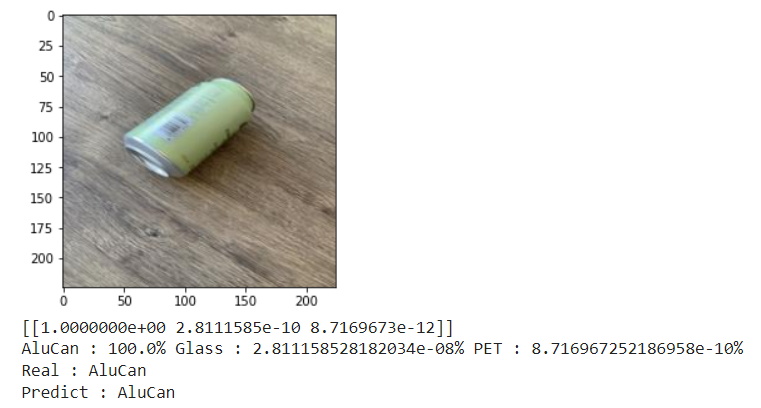
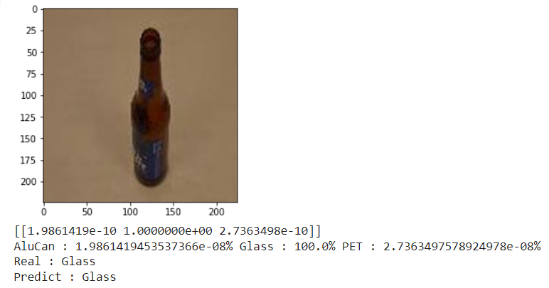
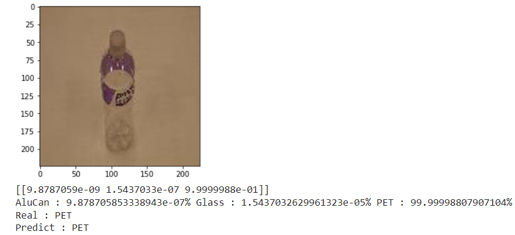

# Drinking-Waste-Classification

## Pre-trained model

Use InceptionV3 as pre-trained model(Freeze the convolutional base)

## Classes

- Aluminium can
- Glass
- PET bottle

## Result example

- Aluminium can
  

- Glass
  

- PET bottle
  

## Dataset

- [dataset-complete](https://drive.google.com/file/d/1fzN-rFtcJ9f9bdCXQIHkjQFNUkjH0ccJ/view?usp=sharing)

## Dataset original source

- [dataset1](https://www.kaggle.com/arkadiyhacks/drinking-waste-classification)
- [dataset2](http://web.cecs.pdx.edu/~singh/rcyc-web/dataset.html)
